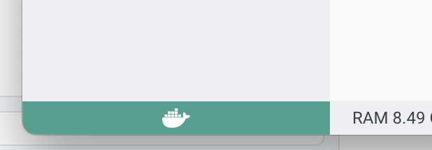
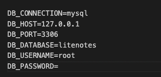
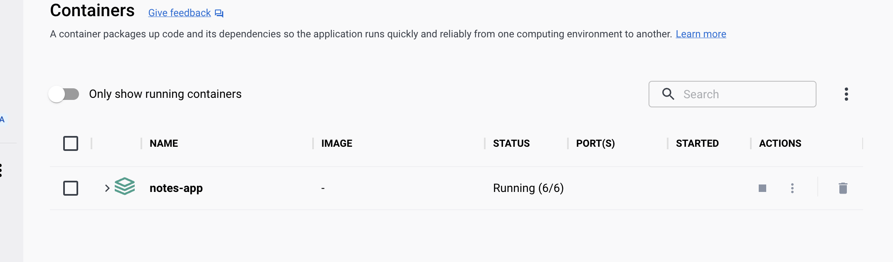

<p align="center">
    
</p>

<br/>

<h2 align="center">The backend for your favorite meeting webpage</h2>

Go to [command page](commands.md) to have a guide of commands to create migrations, controllers, models and more.

<!-- TABLE OF CONTENTS -->
<details open="open">
  <summary><h2 style="display: inline-block"> 📋 Table of Contents</h2></summary>
  <ol>
    <li> Installation and Documentation</li>
    <li> Technology used</li>
    <li> Have a question?</li>
    <li> Found a bug?</li>
    <li> Requirements</li>
    <li> License</li>
  </ol>
</details>


##  🚀&nbsp; Installation and Documentation

You will need to clone the code from [booki-backend](https://github.com/MetaPowerCoders/booki-backend.git).

1. To use this code, you <u>MUST</u> have the following installed:

    1. Docker - [find the link to install it here](https://docs.docker.com/get-docker/)
    2. TablePlus - [find the link to install it here](https://tableplus.com/)
    3. IDE

2. Docker will need to be opened and running. Make sure checking the below:



If this icon is green, you are ready for the next step.

3. Create an .env file, this is same as .env.example but changing the prefered details in the section below:



You will need to use this information after to connect the database with the server.

run:
```
./vendor/bin/sail composer require fruitcake/laravel-cors
```
then:

```
./vendor/bin/sail up
```

Go to [alias page](alias.md) to know how to create an alias and simplify this command. Please note, we will use the simplify command in the following steps.

This will take a bit to install all, once is all done, check on docker if all task are running. Something similar to:



If any task is not running, expand the container and click play in the task missing to make it run.

4. Connect your database on TablePlus.
    1. Open tablePlus and create a new connection.
    2. Enter the details you added on the .env
    3. Click test to make sure all is correct
    4. Connect

5. Run migrations script to have the db up to date:

```
sail artisan migrate
```

You should have the database up to date and ready to be tried!

### **Method available:**

  `GET` | `POST`| `PUT`| `DELETE`


<br>

| Method   | Endpoint                              | Description                                 |  Body     | Response    |
| -------- | ------------------------------------- | ------------------------------------------- |-----------|-------------|
| `GET`    | `/event/{id}`                         | Retrieve the event for specific id.         | none      | event obj   |
| `POST`   | `/event`                              | Create a event.                             | event obj | HTTP verb   |
| `DELETE` | `/event/{id}`                         | Remove event by id                          | none      | HTTP verb   |
| `PUT`    | `/event/{id}`                         | Edit event                                  | event obj | HTTP verb   |
| `GET`    | `/event/{event_id}/booking/`          | Get all bookings associated with an event id group by dates| none      | List < booking obj > |
| `PUT`    | `/event/{event_id}/booking/`          | Edit bookings for specific event id         | booking obj| HTTP verb  |
| `POST`   | `/event/{event_id}/booking/`          | Create a booking for a specific event id    | booking obj| HTTP verb  |
| `GET`    | `/event/{event_id}/booking/{username}`| Retrieve the booking for specific username  | none       | List < booking obj > |

<br>

### **Json to get/post information:**
#### event obj

```
{
	hostName: "Garcia",
	eventName: "Tango",
	?description: "tango meeting",
	durationSeconds: 123456

}
```

#### booking obj

Note: timestamps are day and time calculated in seconds

```
{
    "username" : "Lucas",
    "timestamps" : [212343234, 43243245434]
}
```


## 💻&nbsp; Technologies used


## 👩‍👩‍👧‍👧 Back-end Contributors

Contributors that made this possible:

1. Lorena Gil.
2. Irene Martin

## 📫&nbsp; Have a question? Want to chat? Ran into a problem?

We are happy to hearing about your questions and concerns. Please don't hesitate to contact us for any issue you can experiment.

---

## 🤝&nbsp; Found a bug? Missing a specific feature?

Feel free to **file a new issue** with a respective title and description on the [booki-backend Issues](https://github.com/MetaPowerCoders/booki-backend/issues). I really will appreciate your feedback to improve the system.

---

## ✅&nbsp; Requirements

You should have IDE, docker, tablePlus and Postman. Clone the repository from [booki-backend](https://github.com/MetaPowerCoders/booki-backend.git) and try it!

---

## ©️&nbsp; License

Made with ❤️&nbsp;️ in London. Copyright © 2022 MetaPowerCoders and follow the [MIT License](LICENSE).
