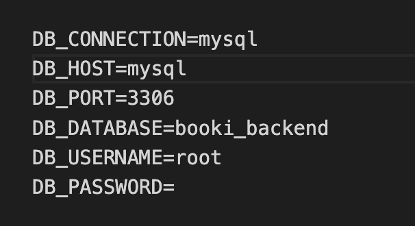

Go to [command page](commands.md) to have a guide of commands to create migraions, controllers, models and more.

##  🚀 Installation and Documentation

1. To use this code, you must have the following installed:
Docker.
2. It will need to be opened and running. Make sure checking the below:


If this icon is green, you are ready for the next step.

3. Create an .env file, this is same as .env.example but changing the prefered details in the section below:



You will need to use this information after to connect the database with the server.

run:

```
./vendor/bin/sail up
```

Go to [alias page](alias.md) to know how to create an alias and simplify this command.

This will take a bit to install all, once is all done, check on docker if all task are running. Something similar to:


If any task is not running, open the container and click play.

4. Connect your database on TablePlus.
    1. Open tablePlus and create a new connection.
    2. Enter the details you added on the .env
    3. Click test to make sure all is correct
    4. Connect

5. Run migrations script to have the db up to date:

```
sail artisan migrate
```

6. Run:

```
npm init vite-app name-app
```
if the terminal is asking you to instal vite proceed with Y. After run:

```
npm install
npm run dev
```

You should see now the webpage in your browser.

### **Method available:**

  `GET` | `POST`| `PUT`| `DELETE`


<br>

| Method   | Endpoint                    | Description                                 |
| -------- | --------------------------- | ------------------------------------------- |
| `GET`    | `/event/{id}`               | Retrieve the event for specific id.         |
| `POST`   | `/event`                    | Create a event.                             |
| `DELETE` | `/event/{id}`               | Remove event by id                          |
| `PUT`    | `/event/{id}`               | Edit event                                  |
| `GET`    | `/event/{event_id}/booking/`| Get all bookings associated with an event id|
| `PUT`    | `/event/{event_id}/booking/`| Edit bookings for specific event id         |
| `POST`   | `/event/{event_id}/booking/`| Create a booking for a specific event id    |


## 💻&nbsp; Technologies used


## 👩‍👩‍👧‍👧 Back-end Contributors

Contributors that made this possible:

1. Lorena Gil.
2. Irene Martin
